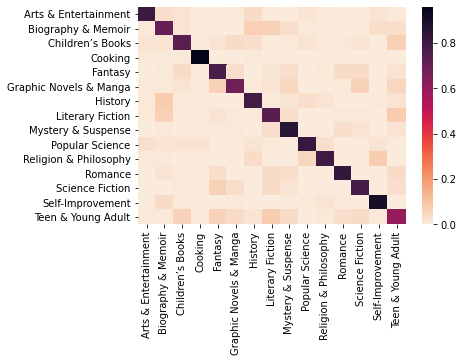

# Blurb Genre Classification

Machine Learning final project by Vincent Nikolayev and Conner Moore. The motivation for our project is to classify books into genres based on their accompanying blurbs (a short summary used as advertising for the book). We believed this to be possible due to the specific vocabulary often used exclusively, or at a higher rate, within certain genres over others. We researched existing work done on text genre classification and found a dataset compiled by the University of Hamburg to be particularly useful for assessing our hypothesis. Using this dataset as a foundation we used various experimental designs, performed feature selection, and tested several Machine Learning models in order to systematically improve the quality of our analysis, our understanding of the underlying data, and ultimately, our ability to accurately predict on interesting and diverse genre classes.

Vincent Nikolayev & Conner Moore  
Professor Rangan  
Machine Learning CS-GY 6923  

## Report

The report is found at: [link](blurb-genre-classification-report.pdf)
